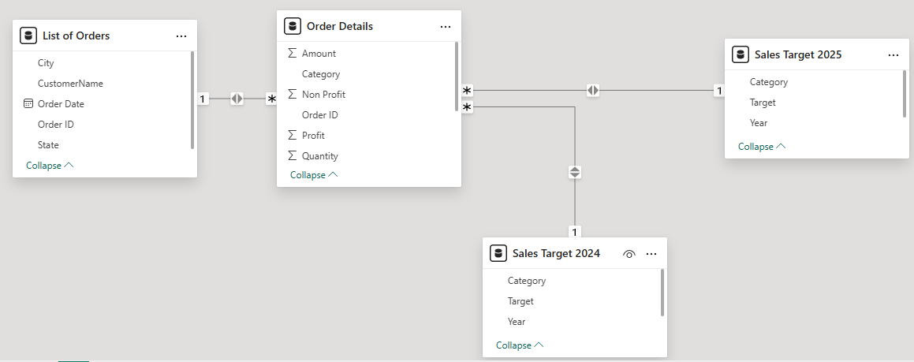

# Power BI E-Commerce Dashboard

---

## 🔗 Access the Dashboard
 
* 📄 **Dashboard Report:**
  👉 [Click here to view the dashboard](./Dashboard/)

---

## 1. Background and Overview

This personal project dashboard analyzes e-commerce performance across Indian states and cities between **2024 and 2025**. It tracks revenue, profit, quantity sold, target achievement, and sub-category contribution.

The purpose of this project is to:

* Monitor total sales, profits, and growth against targets
* Identify high-performing states, cities, and product categories
* Compare revenue trends between 2024 and 2025
* Visualize profit vs. non-profit contributors

---

## 2. Data Structure Overview

The project consists of **4 main tables**, each with specific purposes and relationships:

### A. List of Orders

| Column         | Description                   |
| -------------- | ----------------------------- |
| `Order ID`     | Unique identifier for each order |
| `Order Date`   | Date of the order             |
| `CustomerName` | Name of the customer          |
| `City`         | City of the customer           |
| `State`        | State of the customer          |

### B. Order Details

| Column                           | Description                                  |
| -------------------------------- | -------------------------------------------- |
| `Order ID`                       | Foreign key linked to List of Orders         |
| `Category`                       | Product category (e.g., Accessories, Chairs, etc.)                             |
| `Sub-Category`                   | More specific classification under each category                        |
| `Amount`                 | Total amount of the item purchased                                 |
| `Profit`                 | Profit generated from the sale                                     |
| `Non Profit`             | Value used to capture non-profitable aspects (e.g., shipping cost) |
| `Quantity`                       | Number of items sold                         |
| `Measure Revenue`                | Computed revenue value                       |
| `Measure Selisih dari Target`    | Difference between actual and target revenue |
| `Measure Total Target`           | Total target assigned per category           |

### C. Sales Target 2024

| Column                      | Description         |
| --------------------------- | ------------------- |
| `Category`                  | Product category    |
| `Target`                    | Sales target (2024) |
| `Measure Total Target 2024` | Aggregated value    |
| `Year`                      | Fixed value: 2024   |

### D. Sales Target 2025

| Column                      | Description         |
| --------------------------- | ------------------- |
| `Category`                  | Product category    |
| `Target`                    | Sales target (2025) |
| `Measure Total Target 2025` | Aggregated value    |
| `Year`                      | Fixed value: 2025   |

### F. Entity Relationship Diagram (ERD)

  

### **Table Relationships**

| Source Table   | Target Table      | Join Field | Relationship Type |
| -------------- | ----------------- | ---------- | ----------------- |
| List of Orders | Order Details     | Order ID   | One-to-Many       |
| Order Details  | Sales Target 2024 | Category   | Many-to-One       |
| Order Details  | Sales Target 2025 | Category   | Many-to-One       |

#### **a. List of Orders**

* **Relationship**:

  * **One-to-Many** with **Order Details** via `Order ID`
* **Purpose**: Stores general information for each order.

#### **b. Order Details**

* **Relationships**:

  * **Many-to-One** with **List of Orders** via `Order ID`
  * **Many-to-One** with both **Sales Target 2024** and **Sales Target 2025** via `Category`
* **Purpose**: Contains transaction line-item details for each order.

#### **c. Sales Target 2024**

* **Relationship**:

  * **One-to-Many** with **Order Details** via `Category`
* **Purpose**: Stores 2024 sales targets by category.

#### **d. Sales Target 2025**

* **Relationship**:

  * **One-to-Many** with **Order Details** via `Category`
* **Purpose**: Stores 2025 sales targets by category.

---

## 3. Executive Summary

### Sales and Quantity Performance

* **Total Revenue**: ₹2.15 Million
* **Total Quantity Sold**: 6,000 units
* **Target Sales**: ₹436K (with ₹1.71M overachievement)
* **Target 2024**: ₹142K, **Target 2025**: ₹294K

### Profit Analysis

* **Total Profit**: ₹6.82 Million
* **Non-Profit Elements**: ₹4.42 Million (Red flag)

### Regional Quantity Summary

* **Top States by Quantity**:

  * Madhya Pradesh: 1,360
  * Maharashtra: 1,056
  * Delhi: 277
  * Gujarat: 235

* **Top Cities by Quantity**:

  * Indore: 1,084
  * Mumbai: 727
  * Pune: 329
  * Delhi: 306

### Top Product Value Contributors (Product Relation)

* **Printers**: ₹307.96K
* **Bookcases**: ₹295.60K
* **Saree**: ₹263.52K
* **Chairs**: ₹206.48K
* **Phones**: ₹200.89K
* Lowest: **Leggings** (₹9,061)

---

## 4. Insight Deep Dive

### a. Profit vs. Non-Profit by Sub-Category

| Sub-Category     | Profit     | Non-Profit |
| ---------------- | ---------- | ---------- |
| Printers         | ₹1,032,700 | ₹436,300   |
| Bookcases        | ₹1,021,000 | ₹532,200   |
| Phones           | ₹768,800   | ₹548,100   |
| Saree            | ₹738,600   | ₹703,400   |
| Accessories      | ₹486,600   | ₹130,700   |
| Electronic Games | ₹433,500   | ₹557,100   |
| Tables           | ₹117,600   | ₹518,700   |
| Skirt            | ₹38,900    | ₹15,400    |

---

### b. State & City Breakdown

* **Indore** is the top-performing city with over 1,000 units sold — nearly 18% of total quantity.
* States like **Madhya Pradesh and Maharashtra** outperform others in sales volume.

---

### c. Target Achievement & Year-on-Year Comparison

 Combined **2024–2025 targets (₹436K)** were **exceeded by ₹1.71M**, showing outstanding sales momentum.